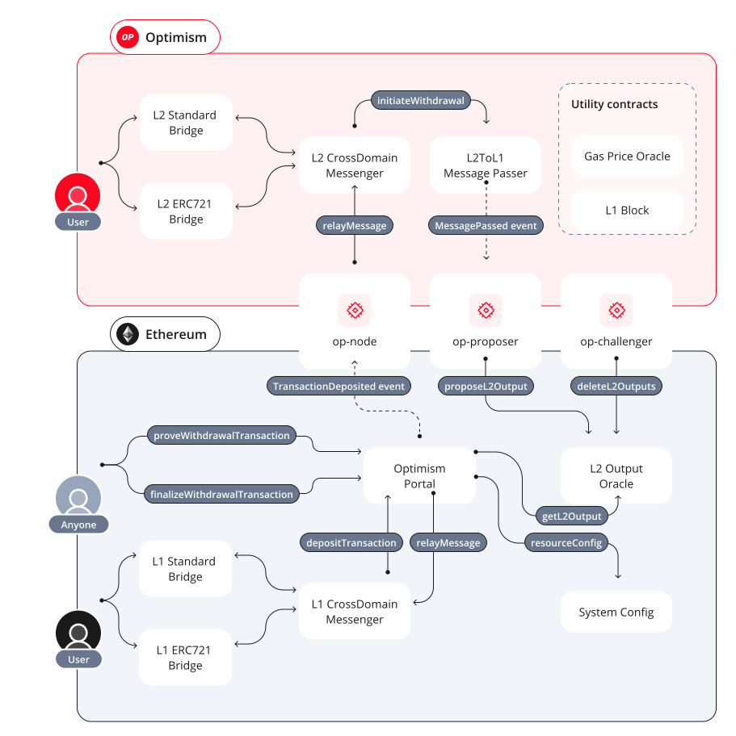

# Optimism Bedrock Contracts Diagram

## Ethereum L1

### [L1StandardBridge.sol](https://github.com/ethereum-optimism/optimism/blob/develop/packages/contracts-bedrock/contracts/L1/L1StandardBridge.sol)

Responsible for transferring ETH and ERC20 tokens between L1 and L2. In the case that an ERC20 token is native to L1, it will be escrowed within this contract. If the ERC20 token is native to L2, it will be burnt. After Bedrock, ETH is stored inside the OptimismPortal contract.

### [L1ERC721Bridge.sol](https://github.com/ethereum-optimism/optimism/blob/develop/packages/contracts-bedrock/contracts/L1/L1ERC721Bridge.sol)

Works together with the L2 ERC721 bridge to make it possible to transfer ERC721 tokens from Ethereum to Optimism. This contract acts as an escrow for ERC721 tokens deposited into L2.

### [L1CrossDomainMessenger.sol](https://github.com/ethereum-optimism/optimism/blob/develop/packages/contracts-bedrock/contracts/L1/L1CrossDomainMessenger.sol)

Message passing interface between L1 and L2 responsible for sending and receiving data on the L1 side. Users are encouraged to use this interface instead of interacting with lower-level contracts directly.

### [OptimismPortal.sol](https://github.com/ethereum-optimism/optimism/blob/develop/packages/contracts-bedrock/contracts/L1/OptimismPortal.sol)

Low-level contract responsible for passing messages between L1 and L2. Messages sent directly to the OptimismPortal have no form of replayability. Users are encouraged to use the L1CrossDomainMessenger for a higher-level interface.

### [SystemConfig.sol](https://github.com/ethereum-optimism/optimism/blob/develop/packages/contracts-bedrock/contracts/L1/SystemConfig.sol)

Used to manage configuration of an Optimism network. All configuration is stored on L1 and picked up by L2 as part of the derivation of the L2 chain.

### [L2OutputOracle.sol](https://github.com/ethereum-optimism/optimism/blob/develop/packages/contracts-bedrock/contracts/L1/L2OutputOracle.sol)

Contains an array of L2 state outputs, where each output is a commitment to the state of the L2 chain. Other contracts like the OptimismPortal use these outputs to verify information about the state of L2.

## Optimism L2

### [L2StandardBridge.sol](https://github.com/ethereum-optimism/optimism/blob/develop/packages/contracts-bedrock/contracts/L2/L2StandardBridge.sol)

Responsible for transferring ETH and ERC20 tokens between L1 and L2. In the case that an ERC20 token is native to L2, it will be escrowed within this contract. If the ERC20 token is native to L1, it will be burnt.

### [L2ERC721Bridge.sol](https://github.com/ethereum-optimism/optimism/blob/develop/packages/contracts-bedrock/contracts/L2/L2ERC721Bridge.sol)

Works together with the L1 ERC721 bridge to make it possible to transfer ERC721 tokens from Ethereum to Optimism. This contract acts as a minter for new tokens when it hears about deposits into the L1 ERC721 bridge. This contract also acts as a burner for tokens being withdrawn.

### [L2CrossDomainMessenger.sol](https://github.com/ethereum-optimism/optimism/blob/develop/packages/contracts-bedrock/contracts/L2/L2CrossDomainMessenger.sol)

High-level interface for message passing between L1 and L2 on the L2 side. Users are generally encouraged to use this contract instead of lower level message passing contracts.

### [L2ToL1MessagePasser.sol](https://github.com/ethereum-optimism/optimism/blob/develop/packages/contracts-bedrock/contracts/L2/L2ToL1MessagePasser.sol)

Dedicated contract where messages that are being sent from L2 to L1 can be stored. The storage root of this contract is pulled up to the top level of the L2 output to reduce the cost of proving the existence of sent messages.

### [GasPriceOracle.sol](https://github.com/ethereum-optimism/optimism/blob/develop/packages/contracts-bedrock/contracts/L2/GasPriceOracle.sol)

Maintains the variables responsible for computing the L1 portion of the total fee charged on L2. This contract now simply proxies the L1Block contract, which has the values used to compute the L1 portion of the fee in its state.

### [L1Block.sol](https://github.com/ethereum-optimism/optimism/blob/develop/packages/contracts-bedrock/contracts/L2/L1Block.sol)

Gives users access to information about the last known L1 block. Values within this contract are updated once per epoch (every L1 block) and can only be set by the "depositor" account, a special system address.
